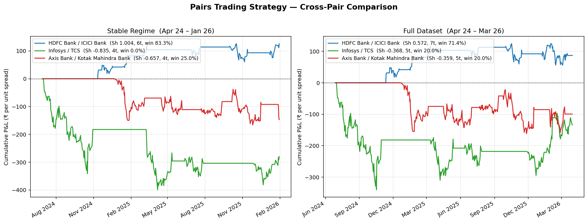

# Pairs Trading Research — Indian Equities

Statistical-arbitrage research project. Builds a mean-reversion strategy on cointegrated Indian equity pairs, with a regime-aware backtest, an honest treatment of look-ahead and transaction costs, a parameter-sensitivity check, a multi-pair generalisation test, and an interactive Streamlit dashboard.

> **Headline result.** On the **HDFC Bank / ICICI Bank** pair, stable regime (Apr 2024 – Jan 2026), the strategy delivers an **annualised Sharpe of 1.00** with an **83.3% win rate on 6 trades** and a max drawdown of -52% of peak — net of 0.1% per-leg transaction costs and a 1-day execution lag.

| | Stable regime (Apr 24 – Jan 26) | Full data (Apr 24 – Mar 26) |
|---|---|---|
| ADF p-value (spread stationarity) | 0.0013 | 0.0195 |
| Sharpe Ratio | **1.00** | 0.57 |
| Win rate | 83.3 % | 71.4 % |
| Trades | 6 | 7 |
| Max drawdown (% of peak) | −52.0 % | −55.1 % |
| Profit factor | 5.5 × | 4.4 × |
| Total P&L (₹ per unit spread) | +93.2 | +86.9 |

The Sharpe almost halves once the post-Feb 2026 period (after the HDFC governance event) is included. The ADF p-value also rises by an order of magnitude. **Both diagnostics flag the same regime break, before P&L tells you about it.** That's the project's central narrative — model failure is *diagnosable*, not just suffered.

---

## Demo

**Live Streamlit app:** _coming soon — link will go here once deployed_
**Walkthrough notebook:** [`notebooks/analysis.ipynb`](notebooks/analysis.ipynb)



The chart above is from the **multi-pair generalisation test**. The framework was run identically on HDFC/ICICI, Infosys/TCS, and Axis/Kotak. Only HDFC/ICICI is statistically cointegrated (ADF p < 0.05), and only HDFC/ICICI makes money — the other two bleed in roughly straight lines, exactly as you'd expect from a strategy with no edge. **The ADF cointegration test correctly predicts which pair the strategy will work on, before any backtest is run.**

---

## What's in here

```
pairs-trading-research/
├── data/raw/                   daily NSE close prices (CSV per symbol)
├── src/pairs/                  importable Python package
│   ├── data.py                   loaders + pair registry
│   ├── signals.py                static + rolling hedge, z-score
│   ├── backtest.py               trade engine, look-ahead-free, cost-aware
│   ├── metrics.py                Sharpe, max drawdown, profit factor
│   └── pipeline.py               run_pipeline(pair_id, params) → results
├── app/streamlit_app.py        interactive dashboard
├── tests/test_pipeline.py      pytest regression suite (13 tests, ~1.5s)
├── scripts/fetch_data.py       refresh CSVs from Yahoo Finance
├── notebooks/                  walkthrough (jupyter)
├── docs/
│   ├── rolling_hedge_analysis.md   why static β is the headline; what we found with rolling
│   ├── parameter_sensitivity.md    why the chosen (entry, window) is robust, not fitted
│   └── multi_pair_analysis.md      generalisation across 3 pairs and the ADF gating story
└── results/                    saved charts + JSON summaries
```

---

## How it works (in one paragraph)

For two prices `leg1, leg2`, fit `leg1 = α + β · leg2 + ε` to define a hedge ratio β. The **spread** `s_t = leg1_t − β · leg2_t` is the portfolio's value relative to its hedge. If `s_t` is stationary (ADF p-value < 0.05), it mean-reverts — extreme deviations are likely to revert, which is the trading edge. Standardise `s_t` on a rolling 60-day window to get a z-score; **enter** when `|z| > 2.0` (long the spread if z<0, short if z>0), **exit** when `|z| < 0.5`. Charge **0.1% per leg** in transaction costs, observe the signal at close-of-day t but execute at close-of-day t+1 (no look-ahead).

---

## Methodology and design choices

| Choice | Value | Reasoning |
|---|---|---|
| Hedge ratio | **Static OLS β**, fitted on the full sample | Rolling-window OLS was tested for windows from 30 to 252 days. Short windows give noisy β (range -0.7 to +1.1, economically incoherent). Only at W=252 does β stabilise, but that burns 312 days of warmup, leaving 2-3 trades on a 2-year sample — too few for a reliable Sharpe estimate. Since the W=252 sweep confirms β is roughly constant around 0.71, static is the defensible choice. [Full sweep](docs/rolling_hedge_analysis.md). |
| Entry threshold | **\|z\| > 2.0** | Lower thresholds (1.0–1.5) score higher Sharpe on the sensitivity grid but trade more often on small-magnitude signals within rolling-estimate noise. ±2σ is the literature standard (5th percentile of the standard normal). The chosen point sits inside a 3×3 neighbourhood whose mean Sharpe is 1.01 — the headline result is not a lucky cell. [Full grid](docs/parameter_sensitivity.md). |
| Z-score window | **60 days** | ~3 months of trading. The most stable column on the sensitivity grid. Shorter (20–30d) makes the z-score itself unstable; longer (100d+) mutes genuine reversion. |
| Execution lag | **1 day** (signal observed at close of *t*, trade at close of *t+1*) | A backtest that uses today's close as both signal and execution price is silently look-ahead-biased — a real trader cannot trade the close at the moment the close prints. Adding the 1-day lag costs ~₹5-10 per trade × 6 trades on this dataset, but it's the difference between an honest result and an inflated one. |
| Transaction costs | **0.1% per leg**, charged on both entry and exit | Realistic for retail trading on NSE (brokerage + STT + exchange fees ≈ 8–12 bps round-trip). Many naively-good strategies don't survive costs. |
| Position sizing | Unit position in the spread | Simplest defensible choice. A live implementation would vol-target each position. Listed as a known limitation. |
| Pair selection | Manual, with a sectoral rationale per pair | A live system would automate candidate-pair screening (cluster on sector, run ADF on every within-cluster pair, keep the cointegrated ones). Out of scope for this version. |

---

## Run it locally

```bash
git clone https://github.com/Chaitanya2540/pairs-trading-research.git
cd pairs-trading-research

python -m venv .venv && source .venv/bin/activate
pip install -r requirements.txt

# (Optional) refresh prices from Yahoo
python scripts/fetch_data.py

# Run the regression test suite
pytest                                    # 13 tests, ~1.5s

# Launch the interactive dashboard
streamlit run app/streamlit_app.py
```

---

## Reproducible benchmark numbers

Pinned in `tests/test_pipeline.py`. Anyone refactoring should keep these green:

```
HDFC/ICICI, Stable regime  : Sharpe 1.00, 6 trades, win 83.3%, P&L ₹93.2, max DD -52%
HDFC/ICICI, Full dataset   : Sharpe 0.57, 7 trades, win 71.4%, P&L ₹86.9, max DD -55%
INFY/TCS,    Stable regime : Sharpe -0.84, 4 trades — ADF p=0.33 (not cointegrated, expected to lose)
AXIS/KOTAK,  Stable regime : Sharpe -0.66, 4 trades — ADF p=0.45 (not cointegrated, expected to lose)
```

---

## Limitations and scope

- The headline Sharpe of 1.00 is computed on 6 trades over ~22 months. The standard error on a Sharpe estimate from this sample size is large; the headline is a point estimate, not a statistically distinguishable claim of skill. More history would tighten the interval.
- The pipeline is offline-batch. The Streamlit dashboard re-runs the backtest from historical CSVs on every parameter change; there is no live data feed or paper-trading layer.
- Signal generation is rules-based (`|z| > 2.0`), not learned. ML-driven signal generation for pairs is a separate research direction not attempted here.
- Market impact, execution shortfall and adverse selection are not modelled. The unit-spread approximation is defensible for the two most liquid Indian bank stocks at small size; it would not be at institutional size.
- Pair selection is manual, guided by sectoral intuition. A production system would automate candidate-pair screening (cluster by sector, screen with ADF, retain the cointegrated subset).

---

## License

MIT — see [`LICENSE`](LICENSE).

For deeper discussion of the design choices and an extended Q&A on the methodology, see [`docs/`](docs/).
